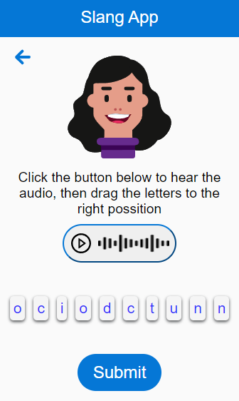

# Slang App

Next Progressive Web App for practicing English pronunciation.

As a PWA, this application is installable locally in both: mobile and desktop.



## Live Demo

[Live version](https://slang-next-app.vercel.app/)

## Built With

- Next JS
- Typescript

## Getting Started

To get a local copy up and running follow these simple example steps.

### Setup

- Open the console
- Download or git clone https://github.com/karmaester/slang-next-app
- cd slang-next-app

Install npm:

```
  sudo apt install npm
```

Install dependencies:

```
  npm install
```

Run app in development mode:

```
  npm run dev
```
## Author

👤 **Khristian Rojas**

- [Github](https://github.com/karmaester)
- [Linkedin](https://www.linkedin.com/in/khristian-rojas/)

## Considerations for future implementations

- Responsiveness for horizontal display in mobile.
- I18n directory structure with JSON files per language, making available avatar feedback in different languages (a useTranslation hook or a language select to implement).
- Animation for characters takes the correct place during response feedback.
- Animation for the audio play button, to be filled according to the audio’s duration (this would require receiving the value in the same request for a new word and using it as a param in that transition).
- Audio’s actual representation instead of the sound-wave.png (with Sass and the knowledge of audios volume per 500ms as values in an array).
- A “learn more” button or “?” icon leads to an “about” page for the app to self-document.
- If allowed to persist data:
    - isNewUser and usersLastUpdate to customize the welcoming message.
    - Save failed attempts to be replayed.
- Provide Gaby with mouth modulation.
- Other avatars could serve to generate storytelling exercises.
- Better chosen messages result from user testing.
- Add a “service unavailable” notice if uptime is untrusted (the current demo API shuts off at night).
- Create an animated checkmark for correct answers.
- Share button to print the record of continuous correct answers and share it as an URL.
- Add unitary and integration testing with jest, cypress, and react-testing-library.
- Elaborate on the implemented libraries in the readme file.
- Include sound effects on correct and incorrect answers.
- For demanding users just like myself, I would add a dark theme.
 
The idea behind creating it as a PWA is that the user can install it on a device, so it can be seen and used often.

Having an avatar as a companion gives the app its own personality, which may result in the user connecting with it (this is a hypothesis that should be validated with user testing).

As SEO practices, I would pay close attention to:
- Time on page.
- Click through rate.
- User’s behavior on each screen.
- Topical authority status according to google’s algorithm.
- Largest contentful paint < 2.5s (with image and script optimization).
- First imput delay < 100ms.
- Cumulative layout shift > 0.1.

There are no instructions regarding the score, that is done on purpose so when the user sends a correct answer and the streak changes or an incorrect answer sets it back to 0 it explains itself, which should lead the user to set a goal for higher streaks (this is also a hypothesis that should be confirmed or discarded).

## 🤝 Contributing

Contributions, issues and feature requests are welcome!

Feel free to check the [issues page](https://github.com/karmaester/slang-next-app/issues).

## Show your support

Give a ⭐️ if you like this project!

## Acknowledgments

- Atlassian (react-beautiful-dnd creators)
- [Joshwcomeau use-sound creator](https://github.com/joshwcomeau/use-sound)

## 📝 License

This project is [MIT](https://opensource.org/licenses/MIT) licensed.
